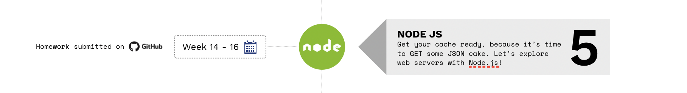

> If you are following the HackYourFuture curriculum we recommend you to start with module 1: [HTML/CSS/GIT](https://github.com/HackYourFuture/HTML-CSS). To get a complete overview of the HackYourFuture curriculum first, click [here](https://github.com/HackYourFuture/curriculum).

> Please help us improve and share your feedback! If you find better tutorials or links, please share them by [opening a pull request](https://github.com/HackYourFuture/Node.js/pulls).

# Module #5 - Understand backend: creating web servers with JavaScript using Node.js (Backend)

So far you've learned about the fundamentals of what makes up a webpage in your browser. We call this `frontend`: the HTML that gives structure to our pages, the CSS that give it a nice look, and the JavaScript that makes our page interactive. Everything you can "see" and "interact" with is made out of these technologies.

However, there is a whole part of applications that you might not be aware of. Have you ever wondered how data moves from one place to another, from one page to another?

This is where `backend` comes into play: all the parts of an application that can't directly be accessed by the user, but happen "behind the screen". Well here's the secret: there is code that tells the computer how to move and manipulate data. This code is hidden away from the user, because there is no need for them to know about it.

During the following 2 weeks you'll be learning all about this. As a tool to illustrate these concepts we will be using `Node.js`: software that allows us to use the language of JavaScript to write backend applications.

## Learning goals

In this module you get familiar with the world of backend development. By the end of it, you have learned:

- What is meant by the term `backend`;
- The `client-server` model;
- What `HTTP` and `REST` mean;
- How to `create your own web servers` with Node.js, using `Express.js`;
- What a `templating engine` is;
- How to use the `Node Package Manager (NPM)`;
- How to use Express.js to make a `RESTful API`;
- How to build a small `full-stack application`.

## Before you start

Before you start you need to install a very important software: Node.js! We're using the latest stable version of it, which is **v16.x**. Click on the following link to download it to your computer:

- For [Ubuntu](https://github.com/nodesource/distributions#debinstall)
- For [macOS](https://nodejs.org/en/download/)
- For [Windows](https://nodejs.org/en/download/)

Verify the installation by running `node -v` (-v is short for version) from the Command Line. It should say: `v16.13.0` or a later version than that.

## How to use this repository

### Repository content

This repository consists of 3 essential parts:

1. `README`: this document contains all the required theory you need to understand **while** working on the assignments. It contains not only the right resources to learn about the concepts, but also lectures done by HackYourFuture teachers. This is the **first thing** you should start with every week
2. `MAKEME`: this document contains the instructions for each week's assignments. Start with the exercises rather quickly, so that you can ground the concepts you read about earlier.
3. `LESSONPLAN`: this document is meant for teachers as a reference. However, as a student don't be shy to take a look at it as well!

### How to study

Let's say you are just starting out with the Node.js module. This is what you do...

1. The week always starts on **Wednesday**. First thing you'll do is open the `README.md` for that week. For the first week of `Node.js`, that would be [Week1 Reading](./week1/README.md)
2. You spend **Wednesday** and **Thursday** going over the resources and try to get a basic understanding of the concepts. In the meanwhile, you'll also implement any feedback you got on last week's assignments (from the Using API's module)
3. On **Friday** you start with the assignments, found in the `MAKEME.md`. For the first week of `Node.js`, that would be [Week1 Assignments](/week1/MAKEME.md)
4. You spend **Friday** and **Saturday** playing around with the exercises and write down any questions you might have
5. **DEADLINE 1**: You'll submit any questions you might have before **Saturday 23.59**, in the class channel
6. On **Sunday** you'll attend class. It'll be of the Q&A format, meaning that there will be no new material. Instead your questions shall be discussed and you can learn from others
7. You spend **Monday** and **Tuesday** finalizing your assignments
8. **DEADLINE 2**: You submit your assignments to the right channels (GitHub) before **Tuesday 23.59**. If you can't make it on time, please communicate it with your mentor
9. Start the new week by going back to point 1!

In summary:

To have a more detailed overview of the guidelines, please read [this document](https://docs.google.com/document/d/1JUaEbxMQTyljAPFsWIbbLwwvvIXZ0VCHmCCN8RaeVIc/edit?usp=sharing) or ask your mentor/class on Slack!

### Video lectures

For each module, HackYourFuture provides you with video lectures. These are made by experienced software developers who know what they're talking about. The main mentor for this module is [Andrej Gajduk](https://hackyourfuture.slack.com/team/UL0P2MB52): Product Owner and Senior Full-Stack Developer!

You can find out more about him here:

- [Personal Website](https://gajd.uk/)
- [GitHub](https://github.com/gajduk)
- [@gajduk on Slack](https://hackyourfuture.slack.com/team/UL0P2MB52)

Learn from Andrej in the following playlist of videos he has made for you! (Click on the image to open the link)

## Planning

| Week | Topic                               | Readings                       | Assignments                       | Lesson Plan                           |
| ---: | ----------------------------------- | ------------------------------ | --------------------------------- | ------------------------------------- |
|   1. | Client-server model, HTTP & Express | [Readings W1](week1/README.md) | [Assignments W1](week1/MAKEME.md) | [Lesson Plan W1](week1/LESSONPLAN.md) |
|   2. | REST, CRUD, API calls      | [Readings W2](week2/README.md) | [Assignments W2](week2/MAKEME.md) | [Lesson Plan W2](week2/LESSONPLAN.md) |
|   3. | User Authentication, session management, Testing      | [Readings W3](week3/README.md) | [Assignments W3](week3/MAKEME.md) | [Lesson Plan W3](week3/LESSONPLAN.md) |

## Finished?

Did you finish the module? You're a rockstar!

If you feel ready for the next challenge, click [here](https://www.github.com/HackYourFuture/databases) to go to Databases!

_The HackYourFuture curriculum is subject to CC BY copyright. This means you can freely use our materials, but just make sure to give us credit for it :)_

 This work is licensed under a <a rel="license" href="http://creativecommons.org/licenses/by/4.0/">Creative Commons Attribution 4.0 International License</a>.
