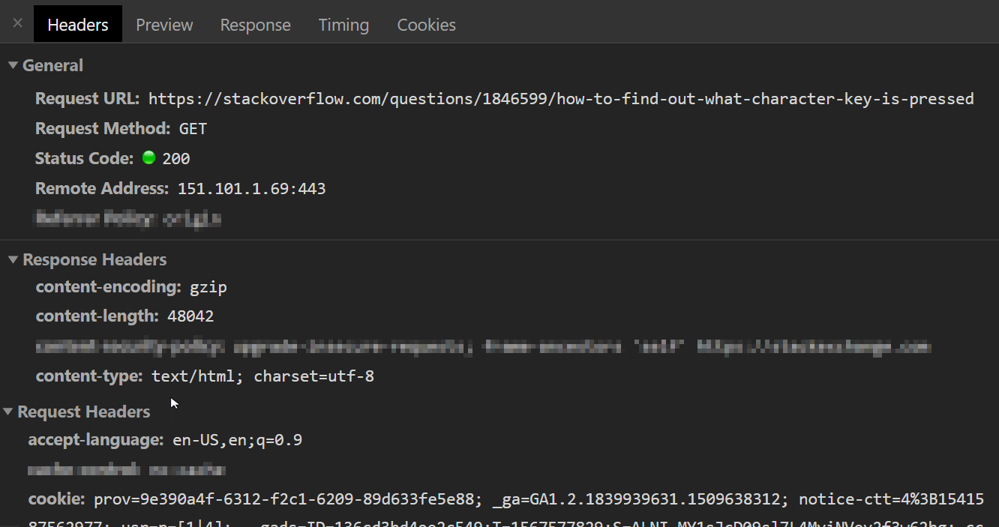

# Node.js Week 2 (Lesson Plan)

## Agenda

1. REST
2. CRUD and HTTP methods
3. RESTful API

## Core concepts

FIRST HALF (12.00 - 13.30)

### REST

**Explanation**

REST stands for REpresentational State Transfer.

1. not restful API just REST

   - focus on resources and how they are the center of REST

   Resource — a resource can be any object the API can provide information about. In Instagram’s API, for example, a resource can be a user, a photo, a hashtag. Each resource has a unique identifier. The identifier can be a name or a number. Now let’s get back to REST.

A RESTful web application exposes information about itself in the form of metadata: descriptions of its resources. It also enables the client to take actions on those resources, such as (1) create new resources (i.e. create a new user) or (2) change existing resources (i.e. edit a post).

- http methods, urls, request body, query parameters, status, response body, error handling

**Example**

Facebook: Explain what are the main resources: users, posts, comments.

**Exercise**

1. Ask students to identify the resources on Github and write them down together.

2. Ask students to identify the following in this screenshot:

- URL
- PORT
- Method
- IP address
- Request ?? status
- Explain request headers
- Response status
- Explain response headers

**Essence**

### CRUD and HTTP methods

**Explanation**

Explain the four operations: create, read, update, delete

How they map to http verbs: post, get, put, delete

**Example**

**Exercise**

**Essence**

### RESTful APIs

**Explanation**

Start by explaining what a web API is: https://hackr.io/blog/web-application-architecture-definition-models-types-and-more/thumbnail/large

Finally complete the full picture of restful APIs: resources and operations.

Mention that RESTful is not the only way to build APIs but do not go into details

**Example**

See Github API for repositories:

https://developer.github.com/v3/repos/#create

https://developer.github.com/v3/repos/#list-your-repositories

https://developer.github.com/v3/repos/#edit

https://developer.github.com/v3/repos/#delete-a-repository

**Exercise**

Ask students to define the endpoints for a library API. Write them together.

**Essence**

SECOND HALF (14.00 - 16.00)

**Build with students**

- library app with the four basic operations, no saving/reading to/from file,
  - make sure to explain how routes are defined (verb + url)
  - how request body can be get
  - how parameters can be extracted from the url (:id)
  - how to generate ids
  - how to respond with the correct status
  - how to correctly handle any errors (return 500 or 404 and a user friendly error message, while logging the error details)
- show how to test the different endpoints and methods using postman
