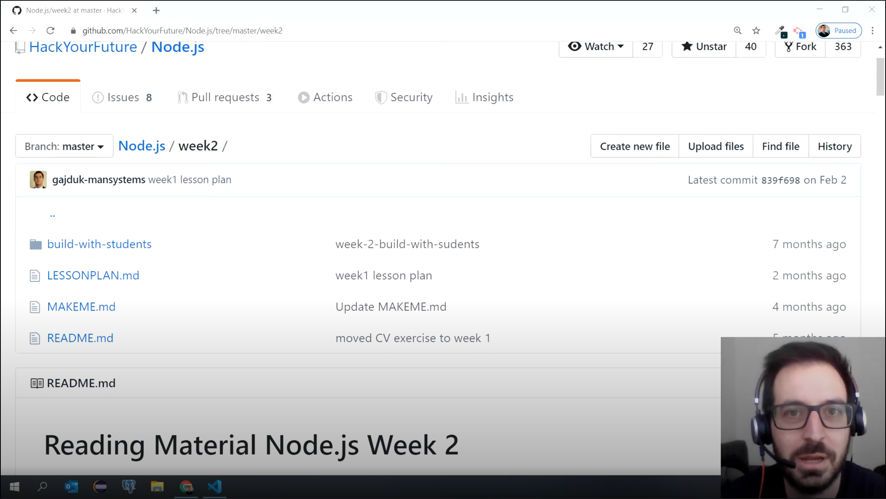

# Reading Material Node.js Week 2

## Agenda

1. [What is a CRUD application?](https://study.hackyourfuture.net/#/definitions/crud)
2. [How do you design an API?](https://study.hackyourfuture.net/#/the-internet/designing-apis.md)
   - What is Representational State Transfer (REST)?
   - What is a RESTful API?

3. [Making use of other APIs](https://study.hackyourfuture.net/#/node-js/consuming-apis.md)
   - How to consume an external API?
   - Example of middleware
4. [Automated API testing](https://study.hackyourfuture.net/#/testing/api-testing.md)
   - [Postman](https://www.postman.com/use-cases/api-testing-automation/)
   - [supertest](https://www.npmjs.com/package/supertest)

## 0. Video Lectures

Your teacher Andrej has made video lectures for this week's material that complements the reading material. You can find them here: [Videos 7 - 10](https://www.youtube.com/playlist?list=PLVYDhqbgYpYXpc_l_Vlj8yz3LjgkkWXnn)

## Week goals

This week we are going to learn some more terms that come up when discussing API's. Let's first start with the term CRUD, read about what this is [here](https://study.hackyourfuture.net/#/definitions/crud).

You might have noticed that the four CRUD actions nicely align with the HTTP methods from last week:

1. Create -> POST
2. Read -> GET
3. Update -> PUT
4. Delete -> DELETE

Having covered these terms we can now look into one of the most common API architectures, the REST API. Have a look at the explanation of this design [here](https://study.hackyourfuture.net/#/the-internet/designing-apis.md).

We will also look into enhancing your API. One thing to keep in mind that your own API can make use of other API's for certain functionality! In fact, this happens all the time and is a great way to split the separation of concerns. Have a look at how this works [here](https://study.hackyourfuture.net/#/node-js/consuming-apis.md).

Lastly, it is time to learn how to automate the testing of our API's. This can be done in Postman using [automated testsuites](https://www.postman.com/use-cases/api-testing-automation/) but we are going to do it using code, similar to unit testing learned in JavaScript. Have a look [here](https://study.hackyourfuture.net/#/testing/api-testing.md) on how to do that using the [supertest](https://www.npmjs.com/package/supertest) library.

## Finished?

Are you finished with going through the materials? High five! If you feel ready to get practical, click [here](./MAKEME.md).
