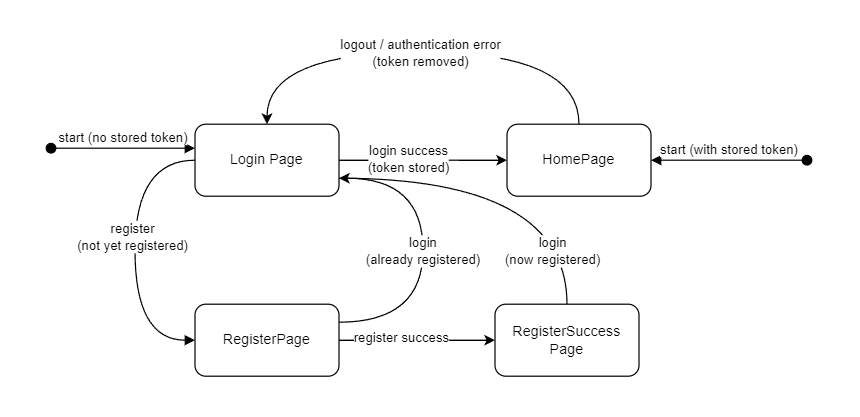

# Server Prep exercise week 3

## Goals

In this exercise, you will build a secure authentication and authorization system using Node.js and Express.js with four main endpoints: `register`, `login`, `getProfile`, and `logout`. The system will utilize JWT (JSON Web Tokens) for managing user sessions.

Files to be modified are located in the `server` folder.

This will allow you to learn and practice using NodeJs and ExpressJs:

  - Securing your application with authentication and authorization principles
  - Implement a standard API for users management with register, login, getProfile, and logout
  - Managing user sessions using JWT (JSON Web Tokens)

## Requirements

You need to implement all those endpoints

**Note:** We provide a helper to store your users so you can focus on learning the security part.
          Please read more in [the next section](#database-helper)

1. Register Endpoint:

   - Implement a `POST` endpoint `/auth/register` that allows users to register with a username and password.
   - Validate the request body to ensure it includes a username and password.
   - Hash the user's password using `bcrypt` before storing it in memory.
   - Return a success message along with the user's ID and username upon successful registration, format: `{id: <id>, username: <username>}`
   - In case of any errors along the way, return an appropriate error message (format: `{message: <message-text>}`) with a corresponding status code in the 40x range.

2. Login Endpoint:

   - Create a `POST` endpoint `/auth/login` that allows users to log in with their registered credentials.
   - Verify the user's credentials by comparing the hashed password stored in memory.
   - If authentication succeeds, generate a JWT containing the user's ID and sign it with a secret key.
   - Return the JWT token to the client upon successful login, format: `{token: <token-value>}` with status code 201.
   - In case of any errors along the way, return an appropriate error message (format: `{message: <message-text>}`) with a corresponding status code in the 40x range.

3. Get Profile Endpoint:

   - Implement a `GET` endpoint `/auth/profile` that allows authenticated users to retrieve their profile information.
   - Extract the JWT token from the Authorization header.
   - Verify the JWT token and decode the payload to retrieve the user's ID.
   - Retrieve the user's profile information from memory using the decoded user ID.
   - Return a message with the user's username upon successful profile retrieval.
   - In case of any errors along the way, return an appropriate error message (format: `{message: <message-text>}`) with a status code 401 (Unauthorized).

4. Logout Endpoint:

   - Create a `POST` endpoint `/auth/logout` that allows users to logout and invalidate their JWT token.
   - No server-side token invalidation is required; the client should handle token deletion.
   - Return a success response with a status code indicating successful logout (e.g., 204 No Content).

## Database helper

We understand there is a lot going on this week. To help you focus on user management, JWT and security, we decided to give you a small `database` tool.

In [`users.js`](./users.js) you will find few lines that has been already added for you:

```javascript
import newDatabase from './database.js'

// Change this boolean to true if you wish to keep your
// users between restart of your application
const isPersistent = true
const database = newDatabase({isPersistent})
```

### To store something

To store something in the database you can use `database.create`

**Important:** `database.create` will create an `id` for you

```javascript
const theObjectIWouldLikeToStore = {
    some: "object with one key"
}

const storedObject = database.create(theObjectIWouldLikeToStore)

console.log(storedObject)
// {
//    some: "object with one key",
//    id: '6a9252f7-d74a-4c6f-8076-dac277549e9b'
// }
```

### To get something from the database

You can only get something by `id` using `database.getById`

It will return the first object it finds with the passed `id` or it will return `undefined`

```javascript
const storedObject = database.getById('6a9252f7-d74a-4c6f-8076-dac277549e9b')
// {
//    some: "object with one key",
//    id: '6a9252f7-d74a-4c6f-8076-dac277549e9b'
// }

const notFoundObject = database.getById('NOT-A-VALID-ID')
// undefined
```


## Client (optional)

While you can test the endpoints of your API with Postman and/or by creating unit tests with Jest and Supertest, we have also provided a fully functional demo front-end application that demonstrates how a web token based authentication system might be used from the front-end side. The demo front-end resides in the `client` folder and is statically served by the backend. The client expects an API that meets the specification as outlined above.

The client allows you to register, login and logout. After logging in, it uses the received JWT token to fetch the profile of the logged-in user and shows it on its home page. If this fetch fails, e.g. due to an expired token, the user is redirected to the login page.

Upon logging in, the client stores the JWT token in `localStorage`. When the client starts it tries to load this token from `localStorage`. If a token was found it try to load the client's home page directly. This may fail if the token is expired as mentioned earlier in which case the login page is loaded. If no token was found in `localStorage` at client startup the login page is loaded directly.

When logging out, the token is removed from `localStorage` and the user is redirected to the login page.

The process is illustrated in the diagram below.



The client code logs debug information in the browser console. This may help you to follow the application flow as you navigate through its pages.
